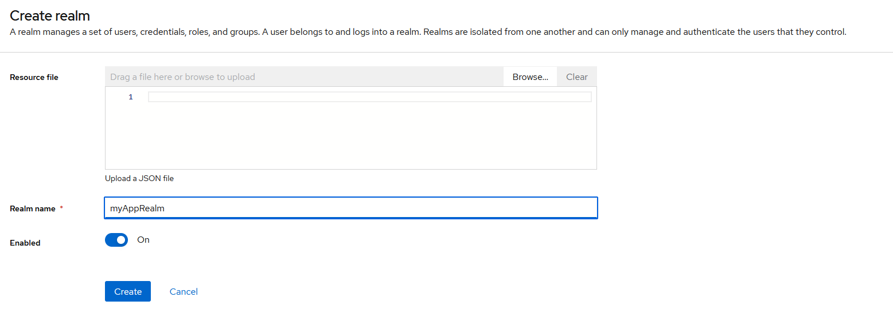
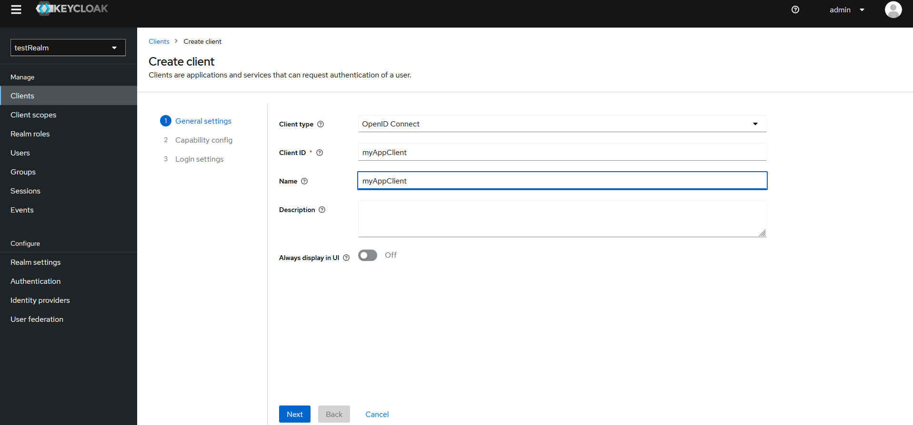
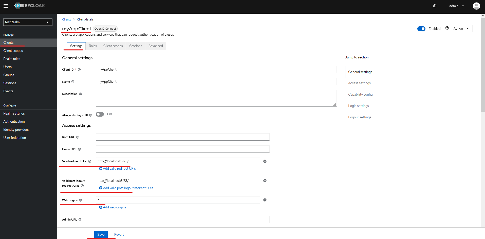
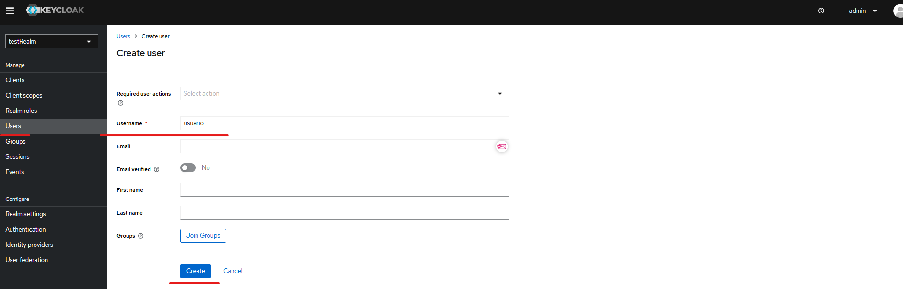
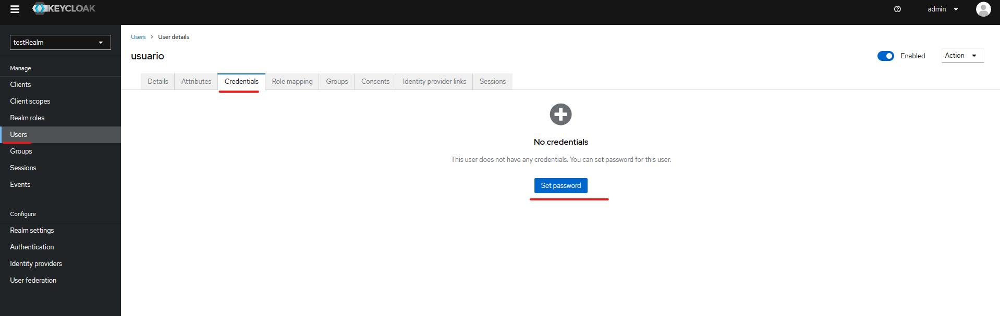
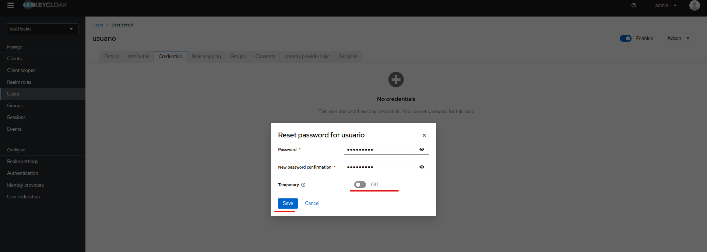
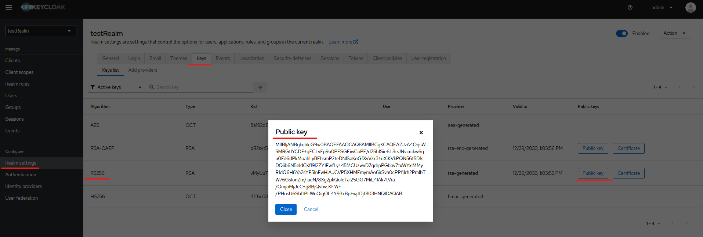
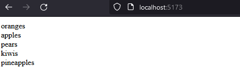
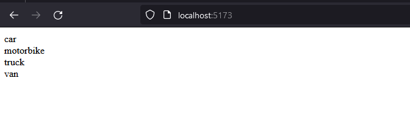
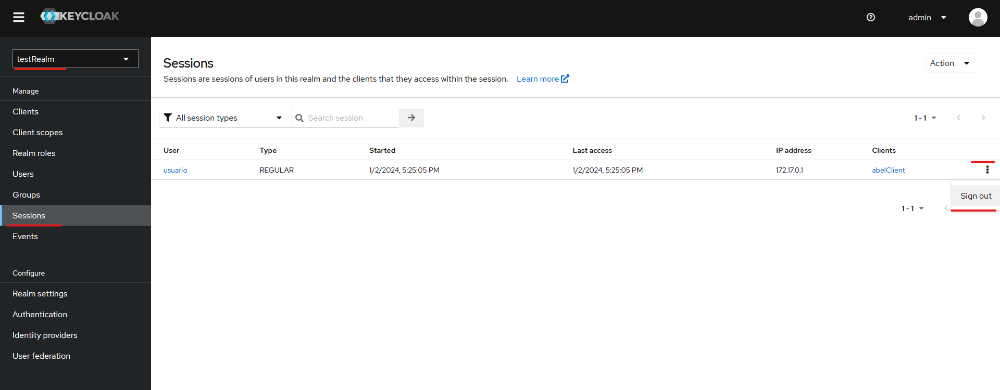

# keycloak
A simple react app with keycloak. User can login with username `usuario` or `usuario2`. Depending of the username, the app will show a list of different data. Hence, different users have different data.

## Requirements

1. Having docker installed in your machine. Documentation how to install [here](https://docs.docker.com/engine/install/ubuntu/#install-using-the-repository).
2. Having nodejs LTS version 20.10.0. Documentation [here](https://nodejs.org/en/download)

## Setup and usage

### 0. Setup keycloak for first time

Run the following command in your terminal.

```shell
docker run -d -p 4000:8080 -e KEYCLOAK_ADMIN=admin -e KEYCLOAK_ADMIN_PASSWORD=admin quay.io/keycloak/keycloak:23.0.3 start-dev
```

This will:

- download the necessary keycloak image from quay.io
- build the container and run it in detached mode
- map it to port 4000

Access Keycloak's Admin Console at `http://localhost:4000/` with credentials `admin/admin` and:

- create a realm
    

- create a client
    

- Set the `http://localhost:5173/` as the valid URIs and `*` as Web Origins (to avoid CORS errors)
    

- Create the following users: `usuario` and `usuario2`
    

- Set password for the users created and make sure it is not temporary.
    
    

- Get your realm's public key and save it for later steps.
    

### 1. Install project dependecies:

From root dir:

```shell
cd Keycloak\ Getting\ Started/
npm install
cd ../backend
npm install
```

### 2. Setup the environment variables

#### For frontend

Create a .env file in `Keycloak Getting Started/.env` dir. Include the following:

```shell
# Whatever variable needs to have the prefix VITE_
# Source: https://stackoverflow.com/questions/70709987/how-to-load-environment-variables-from-env-file-using-vite

VITE_KEYCLOAK_URL=<keycloak_url_and_port>
VITE_KEYCLOAK_REALM=<realm_name>
VITE_KEYCLOAK_CLIENT=<client_name>
```

Example:
```shell
VITE_KEYCLOAK_URL=http://127.0.0.1:4000/
VITE_KEYCLOAK_REALM=myAppRealm
VITE_KEYCLOAK_CLIENT=myAppClient
```

#### For backend

Create a .env file in `backend/.env` dir. Include the following:

```shell
PORT=<your_desired_port>
PUBLIC_KEY=<your_realm_public_key>
```

Example:
```shell
PORT=5000
PUBLIC_KEY=MIIBIjANBgkqhkiG9w0BAQEFAAOCAQ8AMIIBCgKCAQEA2JzA4OrjsW5MRGtlYCDF+gFCLvFp9u0PESGEiwCoPE/d75h1Sie6L8eJNvcrckw6gu0Fd6dPkMoahLyBEhsmP2teDNlSaKoGfXvVzk3+uXiKVkPQN56t5D1sDQiib6N5eldCKfI9l2ZY1EwfLy+45MCUzwvD7qdrpPGbav7txWYxlMMyR1dQ6H6Ya2sYE5lnEwHjAJCVP5XHMFmymAo6irSva0cPPfj1rh2PmlbTW76GsIonZm/iaeN/8Xg2pkQoleTal25GG7MiL4IAk7tVra/OmjoMjJeC+g8BjQvhvsKFWF/PHosU6Sb1tPLWnQigOL4Y93xBp+wjtDjf803HNQIDAQAB
```

### 3. Run the app in dev mode:

Open two terminals, one for the frontend and another for the backend.

#### Launching frontend in dev mode

```shell
cd Keycloak\ Getting\ Started/
npm run dev
```

Runs the frontend in the development mode in `http://localhost:5173/`.


#### Launching backend in dev mode

```shell
cd backend
npm run start
```

Runs the backend in the development mode in `http://localhost:5000/` (or the port specified in the .env file).

### 4. Usage

In your browser, go to `http://localhost:5173/`.
- App will prompt you with a login page.
- If user logs in as `usuario` will see a list of fruits.

    

- If user logs in as `usuario2` will see a list of vehicles.

    

#### Signing out

Currently there's no functionality to sign out through GUI. However, Keycloak admin can sign out a logged in user in the Keycloak's admin console by erasing the user's session:



## Materials used

[Keycloak documentation: Getting started - Docker](https://www.keycloak.org/getting-started/getting-started-docker)

[ Keycloak - A gentle introduction to Keycloak using Vite+React, NodeJS ](https://www.youtube.com/watch?v=5z6gy4WGnUs)


## Authors and acknowledgment

| Developers  | GitHub                                         | LinkedIn                                                           |
| ----------- | ---------------------------------------------- | ------------------------------------------------------------------ |
| Abel Parada | [@abel-parada](https://github.com/abel-parada) | [@abelparadamillan](https://www.linkedin.com/in/abelparadamillan/) |
